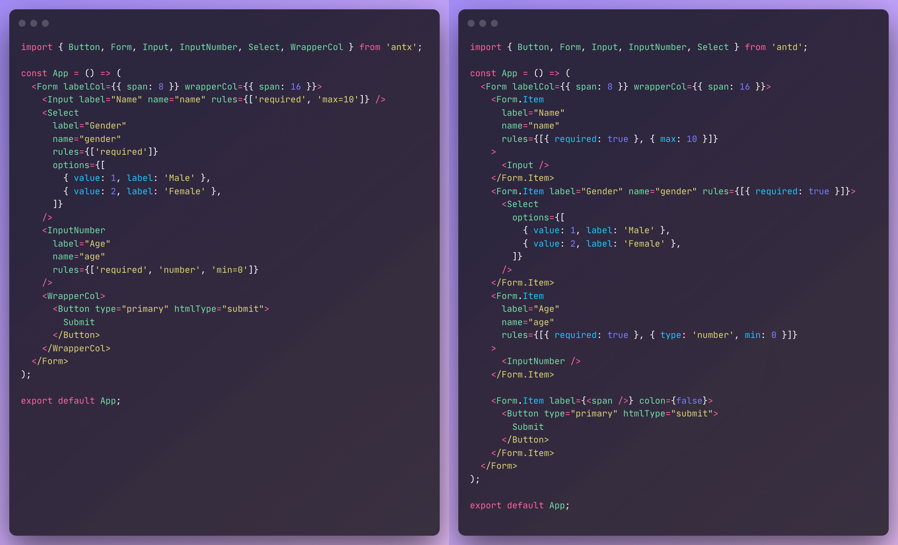

<div align="center">


Ant Design Form Simplified, build forms in the simplest way.

[](https://www.npmjs.com/package/antx)
[](http://www.npmtrends.com/antx)
[](https://bundlephobia.com/result?p=antx)
[](https://github.com/nanxiaobei/ant-plus/blob/main/LICENSE)


English · [简体中文](./README.zh-CN.md)

</div>

---

## Feature

- Say goodbye to cumbersome `<Form.Item>` and `rules`
- Full TypeScript hinting support
- Easily extend existing field components

## Installation

```sh
pnpm add antx
# or
yarn add antx
# or
npm i antx
```

## Usage

```tsx
import { Button, Form, Input, Select, WrapperCol } from 'antx';

const App = () => {
  return (
    <Form labelCol={{ span: 8 }} wrapperCol={{ span: 16 }}>
      <Input label="Name" name="name" rules={['required', 'string']} />
      <Select
        label="Gender"
        name="gender"
        rules={['required', 'number']}
        options={[
          { value: 1, label: 'Male' },
          { value: 2, label: 'Female' },
        ]}
      />
      <InputNumber
        label="Age"
        name="age"
        rules={['required', 'number', 'min=0']}
      />
      <WrapperCol>
        <Button type="primary" htmlType="submit">
          Submit
        </Button>
      </WrapperCol>
    </Form>
  );
};

export default App;
```

[](https://codesandbox.io/s/antx-v4hqw?fontsize=14&hidenavigation=1&theme=dark)

## Introduction

`antx` provides a set of `antd` enhanced form field components, features of enhanced components:

**1. No need to write `<Form.Item>`**  
Directly mix `Form.Item` props with the original field component props (full TypeScript hints), which greatly simplifies the code.

**2. Simplified `rules` (only enhanced, original `rules` is also supported)**  
`rules` in string phrase, for example `rules={['required', 'max=10']}` represents for `rules={[{ required: true }, { max: 10 }]}`.

**3. Not add any new props**  
All props are `antd` original props, without add any other new props or APIs, reducing mental burden.

In addition, `antx` also provides 3 original components (`Form`, `Button`, `Item`), 2 custom components (`WrapperCol`, `Watch`), and a tool function `create`.

## API

### 1. Enhanced field components

> 1st-level field components:

- **AutoComplete**
- **Cascader**
- **Checkbox**
- **DatePicker**
- **Input**
- **InputNumber**
- **Mentions**
- **Radio**
- **Rate**
- **Select**
- **Slider**
- **Switch**
- **TimePicker**
- **Transfer**
- **TreeSelect**
- **Upload**

> 2nd-level field components, in `antd` is `AAA.BBB`, and in `antx` can directly import `BBB`:

- **CheckboxGroup** `Checkbox.Group`
- **DateRange** `DatePicker.RangePicker`
- **TextArea** `Input.TextArea`
- **Search** `Input.Search`
- **Password** `Input.Password`
- **RadioGroup** `Radio.Group`
- **TimeRange** `TimePicker.RangePicker`
- **Dragger** `Upload.Dragger`

### 2. Base components

> `Form`, `Button`, and `Item` are `antd` original components, provided for convenience. `Watch` and `WrapperCol` are custom components.

- **Form**
- **Button**
- **Item** `Form.Item`
- **Watch** used to monitor the changes of form fields, which can be only partial re-render, more refined and better performance

| Props       | Description                                                                                 | Type                                                      | Default |
| ----------- | ------------------------------------------------------------------------------------------- | --------------------------------------------------------- | ------- |
| `name`      | Field to monitor                                                                            | [`NamePath`](https:ant.designcomponentsform-cnNamePath)   | -       |
| `list`      | List of fields to monitor (mutually exclusive with `name`)                                  | `NamePath[]`                                              | -       |
| `children`  | Render props. Get the monitored value (or list), return UI                                  | `(next: any, prev: any, form: FormInstance) => ReactNode` | -       |
| `onlyValid` | Only trigger `children` rendering when the monitored value is not `undefined`               | `boolean`                                                 | `false` |
| `onChange`  | Get the monitored value (or list), handle side effects (mutually exclusive with `children`) | ` (next: any, prev: any, form: FormInstance) => void`     | -       |

```tsx
// Watch usage example
import { Watch } from 'antx';

<Form>
  <Input label="Song" name="song" />
  <Input label="Artist" name="artist" />

  <Watch name="song">
    {(song) => {
      return <div>Song: {song}</div>;
    }}
  </Watch>

  <Watch list={['song', 'artist']}>
    {([song, artist]) => {
      return (
        <div>
          Song: {song}, Artist: {artist}
        </div>
      );
    }}
  </Watch>
</Form>;
```

- **WrapperCol** simplify the layout code, the same props as `Form.Item`, used when the UI needs to be aligned with the input box.

```tsx
// WrapperCol usage example
import { WrapperCol } from 'antx';

<Form>
  <Input label="Song" name="song" />
  <WrapperCol>This is a hint that aligns with the input box</WrapperCol>
</Form>;
```

### 3. `create` tool function

- **create** convert existing form field components into components that support `Form.Item` props mix-in, easily extend existing components.

```tsx
import { create } from 'antx';

// Before expansion
<Form>
  <Form.Item label="Song" name="song" rules={{ required: true }}>
    <MyCustomInput />
  </Form.Item>
</Form>;

// After expansion (TypeScript hints support)
const MyCustomInputPlus = create(MyCustomInput);

<Form>
  <MyCustomInputPlus label="Song" name="song" rules={['required']} />
</Form>;
```

### 4. Simplified `rules`

| Phrase          | Correspondence                         | Description  |
| --------------- | -------------------------------------- | ------------ |
| `'required'`    | `{ required: true }`                   |              |
| `'required=xx'` | `{ required: true, message: 'xx' }`    |              |
| `'string'`      | `{ type: 'string', whitespace: true }` |              |
| `'pureString'`  | `{ type: 'string' }`                   |              |
| `'number'`      | `{ type: 'number' }`                   |              |
| `'array'`       | `{ type: 'array' }`                    |              |
| `'boolean'`     | `{ type: 'boolean' }`                  |              |
| `'url'`         | `{ type: 'url' }`                      |              |
| `'email'`       | `{ type: 'email' }`                    |              |
| `'len=20'`      | `{ len: 20 }`                          | `len === 20` |
| `'max=100'`     | `{ max: 100 }`                         | `max <= 100` |
| `'min=10'`      | `{ min: 10 }`                          | `min >= 10`  |

```tsx
// Simplified rules usage example

<Form>
  <Input label="Song" name="song" rules={['required', 'min=0', 'max=50']} />
</Form>
```

## Comparison

Ant Plus and Ant Design form code comparison:



## License

[MIT License](https://github.com/nanxiaobei/ant-plus/blob/main/LICENSE) (c) [nanxiaobei](https://lee.so/)

## FUTAKE

Try [**FUTAKE**](https://sotake.com/futake) in WeChat. A mini app for your inspiration moments. 🌈


