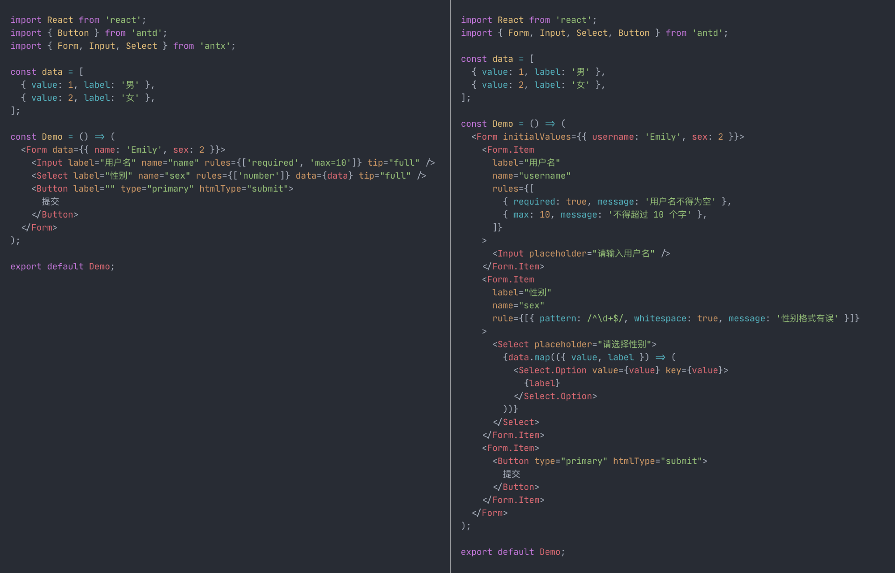

# Ant Plus 4

> Ant Plus 4.0 发布！🎉
>
> ◆ 全面适配 Ant Design 4.0  
> ◆ React Hooks 重写，大幅优化性能  
> ◆ 全新文档设计，优化内容与排版  
> ◆ 所有 `antd` Form 官网示例的 `antx` 实现
>
> 以及 ... 全新 Logo 🦮

Ant Plus 是 Ant Design 表单系统的简化版，以最符合 html 直觉的方式来搭建表单。

[](https://www.npmjs.com/package/antx)
[](http://www.npmtrends.com/antx)
[](https://bundlephobia.com/result?p=antx)
[](https://github.com/nanxiaobei/ant-plus/blob/master/LICENSE)

---

Ant Plus 去除了对 `Form.Item` 的依赖，同时提供了全新的 `rules` 与组件 Props，可大幅简化开发，消灭繁琐样板代码，轻松构建起简洁清晰、利于维护的表单结构。

## 文档

- [文档网站](https://nanxiaobei.github.io/ant-plus) - 查看使用方式与组件 API
- [在线示例](https://codesandbox.io/s/antx-mqxxzrj87j?fontsize=14) - 查看 Ant Design 官网所有 Form 示例的 Ant Plus 对比实现

## 特点

- 极其简便，告别繁琐的 `Form.Item`、`rules` 等
- 简化的 `rules` 设置方式，简化的表单组件 Props
- 可统一定义 `placeholder` 信息与 `rules` 校验提示

## 对比

Ant Plus 与 Ant Design 表单代码对比：



## 安装

```sh
yarn add antx
```

或

```sh
npm install antx
```

## 使用

```jsx
import { Form, Input, Button } from 'antx';

const Demo = () => {
  const onFinish = (values) => {
    console.log(values);
  };
  return (
    <Form data={{ name: 'Emily' }} onFinish={onFinish}>
      <Input label="用户名" name="name" rules={['required', 'max=10']} tip="full" />
      <Button label="" htmlType="submit">
        提交
      </Button>
    </Form>
  );
};

export default Demo;
```

`Form.Item` Props 中的项，均可直接用于表单控件的 Props，如 `label`、`name`、`rules` 等。

此外，Ant Plus 还对 `rules` 进行了简化，可直接使用字符串短语来设置。

## 协议

[MIT License](https://github.com/nanxiaobei/ant-plus/blob/master/LICENSE) (c) [nanxiaobei](https://mrlee.me/)
