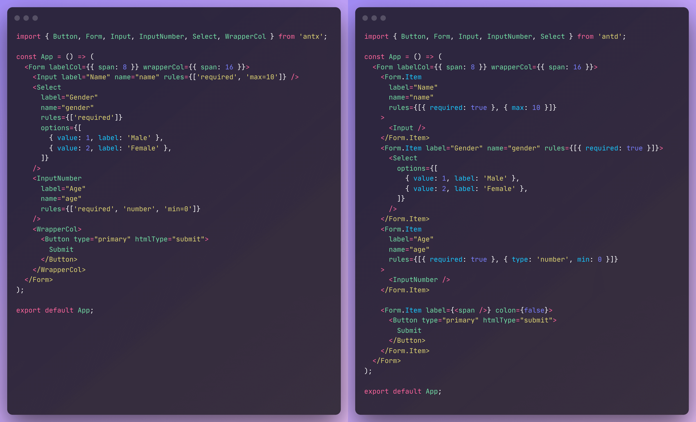

<div align="center">

Link in bio to **widgets**,
your online **home screen**. ➫ [🔗 kee.so](https://kee.so/)

</div>

---

<div align="center">


Ant Design Form 简化版，以最简便的方式搭建表单。

[](https://www.npmjs.com/package/antx)
[](http://www.npmtrends.com/antx)
[](https://bundlephobia.com/result?p=antx)
[](https://github.com/nanxiaobei/ant-plus/blob/main/LICENSE)


[English](./README.md) · 简体中文

</div>

---

## 介绍

`antx` 提供一套 `antd` 混合表单组件的集合：

**1. 告别繁琐的 `<Form.Item>` 与 `rules`**  
直接在表单组件 (如 `Input`) 上混写 `Form.Item` props 与组件 props (完整 TypeScript 支持)，显著简化代码。

**2. 字符串 rules (仅增强，原 rules 写法同样支持)**  
提供 string 形式 rules，例如 `rules={['required', 'max=10']}` 即 `rules={[{ required: true }, { max: 10 }]}`。

**3. 未新增任何 props**  
所有 props 均为 `antd` 组件原有 props，未新增任何其它 props，减少心智负担。

同时 `antx` 还提供了 2 个助手组件 (`WrapperCol`、`Watch`) ，以及一个工具函数 `create()` 用于轻松拓展已有表单组件。

## 对比

Ant Plus 与 Ant Design 表单代码对比：



## 示例

[](https://codesandbox.io/s/antx-v4hqw?fontsize=14&hidenavigation=1&theme=dark)

## 安装

```sh
pnpm add antx
# or
yarn add antx
# or
npm i antx
```

## 使用

```tsx
import { Button, Form } from 'antd';
import { Input, Select, WrapperCol } from 'antx';

const App = () => {
  return (
    <Form labelCol={{ span: 8 }} wrapperCol={{ span: 16 }}>
      <Input label="Name" name="name" rules={['required', 'string']} />
      <Select
        label="Gender"
        name="gender"
        rules={['required', 'number']}
        options={[
          { value: 1, label: 'Male' },
          { value: 2, label: 'Female' },
        ]}
      />
      <InputNumber
        label="Age"
        name="age"
        rules={['required', 'number', 'min=0']}
      />
      <WrapperCol>
        <Button type="primary" htmlType="submit">
          Submit
        </Button>
      </WrapperCol>
    </Form>
  );
};

export default App;
```

## API

### 1. 混合组件

1. **`AutoComplete`**
1. **`Cascader`**
1. **`Checkbox`**
1. **`DatePicker`**
1. **`Input`**
1. **`InputNumber`**
1. **`Mentions`**
1. **`Radio`**
1. **`Rate`**
1. **`Select`**
1. **`Slider`**
1. **`Switch`**
1. **`TimePicker`**
1. **`Transfer`**
1. **`TreeSelect`**
1. **`Upload`**
1. **`CheckboxGroup`** －－－ (`Checkbox.Group`)
1. **`DateRange`** －－－ (`DatePicker.RangePicker`)
1. **`TextArea`** －－－ (`Input.TextArea`)
1. **`Search`** －－－ (`Input.Search`)
1. **`Password`** －－－ (`Input.Password`)
1. **`RadioGroup`** －－－ (`Radio.Group`)
1. **`TimeRange`** －－－ (`TimePicker.RangePicker`)
1. **`Dragger`** －－－ (`Upload.Dragger`)

对于以上所有混合组件，`className` `style` `name` `tooltip` 等 props 将传给 `Form.Item`。

如需传给内部表单组件（如 `Input`），请使用 `selfClass` `selfStyle` `selfName` `selfTooltip`。

### 2. 助手组件

1. **Watch**: 用于监听表单字段变化，可实现仅局部 re-render，更精细、性能更好

| Props       | 说明                                                      | 类型                                                         | 默认值  |
| ----------- | --------------------------------------------------------- | ------------------------------------------------------------ | ------- |
| `name`      | 需监听的字段                                              | [`NamePath`](https://ant.design/components/form-cn#NamePath) | -       |
| `list`      | 需监听的字段列表 (与 `name` 互斥)                         | `NamePath[]`                                                 | -       |
| `children`  | Render props 形式。获取被监听的值 (或列表) ，返回 UI      | `(next: any, prev: any, form: FormInstance) => ReactNode`    | -       |
| `onlyValid` | 被监听的值非 `undefined` 时，才触发 `children` 渲染       | `boolean`                                                    | `false` |
| `onChange`  | 获取被监听的值 (或列表) ，处理副作用 (与 `children` 互斥) | ` (next: any, prev: any, form: FormInstance) => void`        | -       |

```tsx
// Watch 示例
import { Watch } from 'antx';

<Form>
  <Input label="歌曲" name="song" />
  <Input label="歌手" name="artist" />

  <Watch name="song">
    {(song) => {
      return <div>歌曲：{song}</div>;
    }}
  </Watch>

  <Watch list={['song', 'artist']}>
    {([song, artist]) => {
      return (
        <div>
          歌曲：{song}，歌手：{artist}
        </div>
      );
    }}
  </Watch>
</Form>;
```

2. **WrapperCol**: 简化布局代码，props 与` Form.Item` 完全一致，用于 UI 需与输入框对齐的情况

```tsx
// WrapperCol 示例
import { WrapperCol } from 'antx';

<Form>
  <Input label="歌曲" name="song" />
  <WrapperCol>这是一条与输入框对齐的提示</WrapperCol>
</Form>;
```

### 3. `create()` 工具函数

- **create()**: 将已有表单组件，包装为支持 `Form.Item` props 混写的组件，轻松拓展现有组件

```tsx
import { create } from 'antx';

// 拓展前
<Form>
  <Form.Item label="歌曲" name="song" rules={{ required: true }}>
    <MyCustomInput />
  </Form.Item>
</Form>;

// 使用 create() 拓展
const MyCustomInputPlus = create(MyCustomInput);

// 拓展后
<Form>
  <MyCustomInputPlus label="歌曲" name="song" rules={['required']} />
</Form>;
```

### 4. 字符串 `rules`

| 字符串          | 对应                                   | 说明         |
| --------------- | -------------------------------------- | ------------ |
| `'required'`    | `{ required: true }`                   |              |
| `'required=xx'` | `{ required: true, message: 'xx' }`    |              |
| `'string'`      | `{ type: 'string', whitespace: true }` |              |
| `'pureString'`  | `{ type: 'string' }`                   |              |
| `'number'`      | `{ type: 'number' }`                   |              |
| `'array'`       | `{ type: 'array' }`                    |              |
| `'boolean'`     | `{ type: 'boolean' }`                  |              |
| `'url'`         | `{ type: 'url' }`                      |              |
| `'email'`       | `{ type: 'email' }`                    |              |
| `'len=20'`      | `{ len: 20 }`                          | `len === 20` |
| `'max=100'`     | `{ max: 100 }`                         | `max <= 100` |
| `'min=10'`      | `{ min: 10 }`                          | `min >= 10`  |

```tsx
// 字符串 rules 示例
<Form>
  <Input label="歌曲" name="song" rules={['required', 'min=0', 'max=50']} />
</Form>
```

## 协议

[MIT License](https://github.com/nanxiaobei/ant-plus/blob/main/LICENSE) (c) [nanxiaobei](https://lee.so/)
